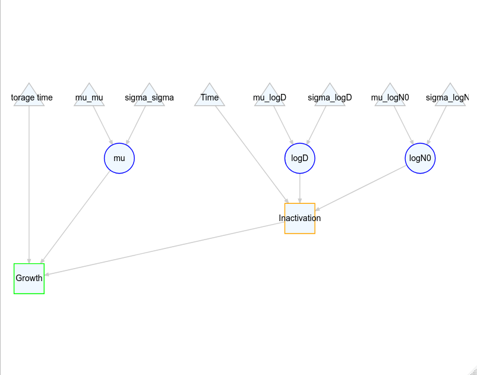

<!-- README.md is generated from README.Rmd. Please edit that file -->

# biorisk

The goal of biogrowth is to ease the development of mathematical models
for quantitative microbial risk assessment. It follows the approach of
the Modular Process Risk Model using R6 classes.

The package is still under development.

## Authors

Questions and comments can be directed to Alberto Garre
(alberto.garreperez (at) wur.nl).

## Example

The package follows the principles of the MPRM approach, where each
process is described using an independent module. For instance,
microbial inactivation can be simulated using the `LogLinInactivation`
class. These modules can also represent distributions (normal,
exponential…).

Modules are linked using inputs that are specific for each module. In
the case of the log-linear inactivation, these inputs are the treatment
time (`t`), the logarithm of the D-value (`logD`) and the logarithm of
the initial count (`logN0`). The package allows to assign constant
values, distributions or the output of risk modules to each input.

As an example, the following code chunk defines an inactivation model
where the treatment time is constant, and both the logarithm of the
D-value and the logarithm of the initial microbial count are normally
distributed.

``` r
library(biorisk)
library(tidyverse)
#> ── Attaching packages ─────────────────────────────────────── tidyverse 1.3.0 ──
#> ✓ ggplot2 3.3.2     ✓ purrr   0.3.4
#> ✓ tibble  3.0.4     ✓ dplyr   1.0.2
#> ✓ tidyr   1.1.2     ✓ stringr 1.4.0
#> ✓ readr   1.4.0     ✓ forcats 0.5.0
#> ── Conflicts ────────────────────────────────────────── tidyverse_conflicts() ──
#> x dplyr::filter() masks stats::filter()
#> x dplyr::lag()    masks stats::lag()

treat_time <- Constant$new("Time", 30)

logD <- Normal$new("logD")$
  map_input("mu", Constant$new("mu_logD", 1))$
  map_input("sigma", Constant$new("sigma_logD", 0.2))

logN0 <- Normal$new("logN0")$
  map_input("mu", Constant$new("mu_logN0", 2))$
  map_input("sigma", Constant$new("sigma_logN0", 0.5))

inact_model <- LogLinInactivation$new("Inactivation")$
  map_input("t", treat_time)$
  map_input("logD", logD)$
  map_input("logN0", logN0)
```

We can extend the risk model defining a growth module whose initial
concentration is the output of the inactivation model.

``` r
stor_time <- Constant$new("Storage time", 3)

mu <- Normal$new("mu")$
  map_input("mu", Constant$new("mu_mu", 1))$
  map_input("sigma", Constant$new("sigma_sigma", 0.2))

growth_model <- ExponentialGrowth$new("Growth")$
  map_input("t", stor_time)$
  map_input("mu", mu)$
  map_input("logN0", inact_model)
```

The package includes function to aid in the visualization of the model.

``` r
plot_model(growth_model)
```



It can also be used to simulate the model using Monte Carlo simulations

``` r
invisible(growth_model$simulate(1000))

tibble(
  logN0 = logN0$get_output(),
  treatment = inact_model$get_output(),
  consumer = growth_model$get_output()
) %>%
  pivot_longer(everything(), names_to = "step", values_to = "logN") %>%
  mutate(step = factor(step, levels = c("logN0", "treatment", "consumer"))) %>%
  ggplot() +
  geom_boxplot(aes(x = step, y = logN))
```


